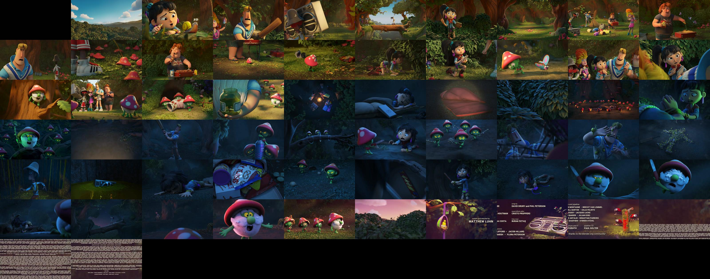

# Video Storybook

Video storybook (thumbnail sprite) generator library using ffmpeg.

## Requirements

- ffmpeg

# Example

```go
fileName := "./sample.mp4"
videoMetadata, err := vtsg.GetMetadata(fileName)

if err != nil {
    log.Fatalln("Error while reading video metadata: " + err.Error())
}

duration := videoMetadata.Duration
tileCount := int(math.Ceil(duration / float64(interval)))
tileWidth, tileHeight, err := vtsg.CalculateTileDimensions(videoMetadata.Width, videoMetadata.Height, maxTileWidth, maxTileHeight)

if err != nil {
    log.Fatalln("Error calculating tile dimensions: " + err.Error())
}

columns := min(tileCount, maxColumns)
rows := int(math.Ceil(float64(tileCount) / float64(maxColumns)))
storyboardBuffer, err := vtsg.GenerateStoryboardImage(fileName, interval, columns, rows, tileWidth, tileHeight)

if err != nil {
    log.Fatalln("Error creating storyboard: " + err.Error())
}

err = os.WriteFile(outputFileName, storyboardBuffer.Bytes(), 0777)
```

The sprite was generated from [some Blender sample video](https://files.vidstack.io/sprite-fight/720p.mp4).

